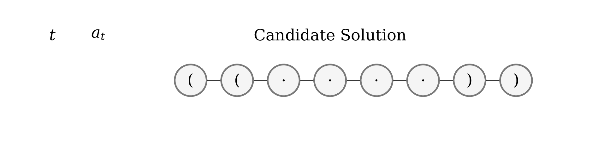

# **Learning to Design RNA**

In this repository we provide the code accompanying our publication

> [Learning to Design RNA](https://openreview.net/pdf?id=ByfyHh05tQ)  
> Frederic Runge, Danny Stoll, Stefan Falkner, Frank Hutter  
> In *Proceedings of the International Conference on Learning Representations (ICLR 2019)*, 2019.


***Figure 1:** Illustration of an action rollout. The agent sequentially builds a candidate solution by choosing actions to place nucleotides. At paired sites, as indicated by a pair of brackets, two nucleotides are placed simultaneously (t = 0 and t = 1); while at unpaired sites a single nucleotide is placed.*

In our algorithm, we employ deep reinforcement learning to yield agents, capable of designing RNA sequences that satisfy given structural constraints in an end-to-end fashion. In particular, we provide source code to run:

#### *LEARNA*:
A ready to use deep reinforcement learning implementation for RNA Design. Utilizing PPO [[Schulman et al., 2017]](https://arxiv.org/abs/1707.06347), the agent learns a policy for solving individual RNA Design problems in an end-to-end fashion from scratch.

#### *Meta-LEARNA*:
A meta-learning approach for RNA Design utilizing a single policy, pre-trained across thousands of different RNA design tasks, capable of solving new RNA Design tasks by transfering the learned knowledge.

#### *Meta-LEARNA-Adapt*:
A deep reinforcement learning approach combining the strategies of *LEARNA* and *Meta-LEARNA* by warmstarting *LEARNA* using the policy of *Meta-LEARNA* for initialization of the weights and continuing learning the policy on new RNA Design problems.

---

&nbsp;  

# Citation
To cite our work, please reference our ICLR 2019 paper
```
@inproceedings{
runge2018learning,
title={Learning to Design {RNA}},
author={Frederic Runge and Danny Stoll and Stefan Falkner and Frank Hutter},
booktitle={International Conference on Learning Representations},
year={2019},
url={https://openreview.net/forum?id=ByfyHh05tQ},
}
```
---

&nbsp;  


# Installation

#### Note: Our installation pipeline includes an installation of miniconda to setup an environment called `learna` to make installation of all requirements as easy as possible. We also provide commands for removing all installed components (see Utilities). However, if you do not want to use our installation pipeline for any reasons, make sure your system satisfies the following requirements before running the provided scripts.

&nbsp;   

## Requirements

The following software is required to run our code:
* Python version 3.6 or higher
* ViennaRNA (recommended version: 2.4.8)
* numpy
* pandas version 0.22
* requests
* pytest (for running tests only)
* tensorflow version 1.4.0
* pynisher
* hpbandster
* tqdm
* Distance
* tensorforce version 0.3.3
* dataclasses

To install all requirements automatically, including the setup of a conda environment called `learna` via miniconda, simply type the following command:

```
make requirements
```

We tested the installation on the following operating systems:
* CentOS Linux release 7.4.1708
* Korora release 26
* Ubuntu 16.04.5 LTS

&nbsp;  

## Datasets

To download and build the datasets we report on in our publications, namely the Eterna100 [[Anderson-Lee et al., 2016]](https://www.ncbi.nlm.nih.gov/pmc/articles/PMC4833017/pdf/nihms747287.pdf) dataset, the Rfam-Taneda [[Taneda, 2011]](https://www.ncbi.nlm.nih.gov/pmc/articles/PMC3169953/pdf/aabc-4-001.pdf) dataset and our three proposed datasets, Rfam-Learn-Train, Rfam-Learn-Validation and Rfam-Learn-Test, run the following command after installation of all requirements.

```
make data
```

This will download all files and save them into the `data/` directory.
Additionally, individual datasets can be downloaded and build via the following commands

```
make data-eterna
make data-rfam-taneda
make data-rfam-learn
```

For testing your installation type

```
make experiment-test
```

to run *LEARNA* on a single secondary structure of the Eterna100 dataset for 30 seconds.

---

&nbsp;  

# Usage

#### Note: All following commands using `make` will automatically activate the `learna` conda environment. If you did not follow our installation guide, we recommend having a look into our `Makefile` to run the specific commands manually.

&nbsp;   

## Utilities
All installed components, including the conda environment, can be removed via
```
make clean
```
To see a list of all `make` targets with short explanation, type
```
make show-help
```

&nbsp;  

## Reproduce Results

&nbsp;  

### Single Decision Process via `make`

To limit computational costs we provide commands to reproduce our results for single target structures of any of the benchmarks instead of providing a pipeline directly involving entire datasets. The following commands will run one of the finally selected configurations on a single target structure

#### *LEARNA*
```
make reproduce-LEARNA-<benchmark>-<id>
```  
#### *Meta-LEARNA*
```
make reproduce-Meta-LEARNA-<benchmark>-<id>
```
#### *Meta-LEARNA-Adapt*
```
make reproduce-Meta-LEARNA-Adapt-<benchmark>-<id>
```
`<benchmark>` could be any of the three benchmarks `Eterna`, `Rfam-Taneda`, `Rfam-Learn-Test`.
`<id>` corresponds to one of the target structures as reported in our publication.

&nbsp;  

### Timed Execution
To have a standardized timing for all algorithms without using internal timeouts, we decided to limit the runtime using [pynisher](https://github.com/sfalkner/pynisher). We provide our script for timed execution and our execution scripts for running our approaches.
The following scripts are available in the `utils/` directory:

* `timed_execution.py`: Script for timing control using `pynisher`
* `execution_scripts/{LEARNA-10min, LEARNA-30min, Meta-LEARNA}.sh`: Scripts containing the final configurations

All `execution_scripts` can be run locally using the `timed_execution` script. To do so run the following command after activation of the `learna` environment from the project's root directory
```
python utils/timed_execution.py \
  --timeout <Timeout in seconds> \
  --data_dir <Root directory of data> \
  --results_dir <Results directory> \
  --experiment_group <Name of the experiment group> \
  --method <Name of the execution_script> \
  --dataset <Name of the dataset> \
  --task_id <Target Structure id>
```
Options:
* `timeout`: The timeout needs to be set in seconds
* `data_dir`: Use `data/`
* `results_dir`: Any output directory of your choice
* `experiment_group`: Any name you would like to provide (defines the name of the output directory inside `results_dir`
* `method`: One of `LEARNA-10min`, `LEARNA-30min`, `Meta-LEARNA`
* `dataset`: One of `eterna`, `rfam_taneda`, `rfam_learn/test`
* `task_id`: An id of any target structure of the corresponding dataset

This will call the specified `execution_script` containing one of the finally selected configurations of *LEARNA*, *Meta-LEARNA* or *Meta-LEARNA-Adapt*. The script will run until the `timeout` was reached and is then interrupted using `pynisher`.

An example call can be executed from the project root via
```
make timed-execution-example-<id>
```
This creates a `results/<experiment_group>/<dataset>/<execution_script>/run-0` directory after running *LEARNA-30min* for 30 seconds on the target structure `<id>` of the Eterna100 dataset. If the sequence was solved, the directory contains the files `<id>.out` with the algorithms output and `<id>.time` to analyse the timing, otherwise, if the target hasn't beein solved within the given time interval, the directory is empty.

&nbsp;  

#### Note: The only difference between *Meta-LEARNA* and *Meta-LEARNA-Adapt* is an additional option called `--stop-learning` that needs to be removed in the `exectution_script` for *Meta-LEARNA* `Meta-LEARNA.sh` to run *Meta-LEARNA-Adapt* instead of *Meta-LEARNA*.

&nbsp;  

## Joint Architecture and Hyperparameter Search

We used the recently proposed optimizer BOHB [[Falkner et al., 2018]](http://proceedings.mlr.press/v80/falkner18a.html) to jointly optimize the architecture of our policy networks, the training hyperparameters as well as the state representation.

For completeness, we also provide our implementation of workers for BOHB, as well as the main file `bohb.py` in the `src/optimization` directory to start BOHB optimizing our approach. A very basic example call of the BOHB pipeline can be run via
```
make bohb-example
```

For more informations on customizing BOHB for usage in your projects we refer to the [HpBandSter's github Repository](https://github.com/automl/HpBandSter) and its associated [documentation](https://automl.github.io/HpBandSter/build/html/index.html).

---
